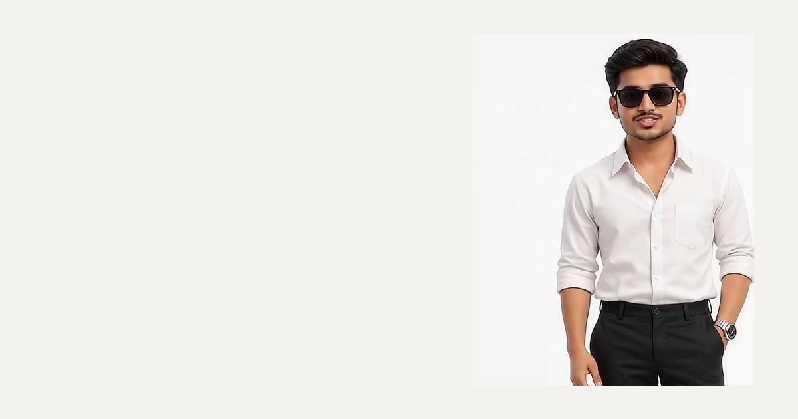

# Shakti Pad Mahato — Personal Portfolio

<p align="center">
  <a href="https://shaktipadmahato.vercel.app">
    
  </a>
</p>

<p align="center">
  <strong>Full Stack Developer & Data Analyst</strong>
</p>

<p align="center">
  <a href="https://shaktipadmahato.vercel.app"></a>
  <a href="https://github.com/shaktixgit"></a>
  <a href="https://www.linkedin.com/in/shakti-pad-mahato-0a187a249/"></a>
</p>

<p align="center">
  
  
  
  
  
  
  
</p>

---

## ✦ Overview

A production-ready, editorial personal portfolio website engineered with a **quiet luxury** aesthetic inspired by Awwwards "Site of the Day" showcases. Built with a restrained chromatic palette (warm off-white `--paper: #f4f2ee`, solid ink `--ink: #0d0d0d`, and fine gray tones), self-hosted typography, and ultra-smooth hardware-accelerated motion without heavy 3D or WebGL libraries.

Every single metric, date, certification, link, and experience entry is 100% faithful to the official résumé — zero fabricated claims.

### 🌐 Live Deployment
The portfolio is deployed to Vercel's global Edge Network:  
👉 **[https://shaktipadmahato.vercel.app](https://shaktipadmahato.vercel.app)**

---

## ✦ Key Architectural Features

### 1. Seamless Looping Hero Video
- **Neural Studio Matting**: Rendered using `isnet-general-use` with custom alpha defringing to achieve pixel-perfect boundary separation around hair, sleeves, and shoulders.
- **Native Canvas Compositing**: Video background is composited directly onto `#f4f2ee` (RGB: 244, 242, 238) for H.264/MP4 and encoded with transparent alpha for VP9/WebM, eliminating white boxes across all devices and hardware overlays.
- **Smart Audio Unlocking**: Full compliance with browser Autoplay Policies. The video starts instantly, listening for the user's first gesture (`pointerdown`, `click`, `scroll`) to seamlessly unmute voice at full fidelity, accompanied by a floating one-click unlock pill.
- **Viewport Visibility Observer**: Pauses video playback when the hero drops below 35% visibility to conserve GPU and battery resources, resuming seamlessly on scroll return.

### 2. Realistic Hanging Lanyard Developer ID
- Realistic lanyard strap (30×56 px) with woven typography and metallic clip.
- Damped spring pendulum physics that reacts dynamically to cursor velocity and natural idle drift.
- Dual-sided 3D card with smooth hover/touch flip:
  - **Front**: High-contrast header, circular portrait halo, ID credentials, valid-till graduation date, and monochromatic hologram sticker.
  - **Back**: Verified competencies, degree milestones, and quick-action résumé links.

### 3. Dynamic Floating Navigation
- Monogram mark that fills to solid ink and rotates 360° on scroll.
- Frosted glass capsule (`backdrop-filter: blur(12px)`) with a sliding ink pill tracking active sections via `IntersectionObserver`.
- Top hairline 2 px scroll-progress monitor.
- Full-screen animated mobile menu with clip-path reveal and body scroll lock.

### 4. Verified Showcase Sections
- **Skills Matrix**: Categorized tech stacks featuring real brand SVG vectors and gentle brand-tinted glows.
- **Selected Work**: Highlighting *Stock Market Analysis & Prediction Engine*, *Dynamic Pricing Engine for E-commerce*, and *AI-driven Dynamic E-commerce Pricing*.
- **Licenses & Certifications**: Verified credentials from Google, Meta, IBM, Harvard University, Cisco, PwC, Microsoft, and Infosys.
- **Experience & Education**: Timeline detailing roles at Cloud Counselage, Cognifyz, Encryptix, and academics at Galgotias University & Techno India.

---

## ✦ Design System

```css
:root {
  --paper: #f4f2ee; /* Canvas backdrop (warm off-white) */
  --card:  #ffffff; /* Surface cards */
  --ink:   #0d0d0d; /* Primary typography & active states */
  --ink-2: #3a3a3a; /* Secondary body */
  --mute:  #77756f; /* Muted accents & italic counters */
  --line:  rgba(13, 13, 13, 0.1); /* 1px hairlines */
  --ease:  cubic-bezier(0.16, 1, 0.3, 1); /* Custom spring ease */
}
```

### Self-Hosted Typography
- **Display & Body**: `Inter Tight` (Variable, −0.045em tracking)
- **Italic Accent**: `Instrument Serif` (1 italic accent word per section heading)
- **Labels & Numbers**: `JetBrains Mono` (Indices, metrics, and meta tags)

---

## ✦ Project Structure

```
PORTFOLIO/
├── public/
│   ├── hero/
│   │   ├── hero.mp4            # Clean H.264 video on #f4f2ee background
│   │   └── hero.webm           # VP9 video with transparent alpha
│   ├── logos/                  # Official SVGs for tech stack & credentials
│   ├── og.jpg                  # OpenGraph preview banner (1200x630)
│   ├── portrait-bust.webp      # Clear 480x600 bust portrait
│   └── resume.pdf              # Official downloadable résumé
├── scripts/
│   └── render_perfect_video.py # Python matting pipeline (isnet + ffmpeg)
├── src/
│   ├── app/
│   │   ├── globals.css         # Tailwind 4 theme & component layers
│   │   ├── layout.tsx          # Local fonts, metadata, themeColor #f4f2ee
│   │   └── page.tsx            # Root page composition
│   ├── components/
│   │   ├── hero/Hero.tsx       # Looping video hero & sound controller
│   │   ├── sections/
│   │   │   ├── About.tsx       # Hanging 3D lanyard ID card
│   │   │   ├── Skills.tsx      # Categorized skill badges & brand glow
│   │   │   ├── Work.tsx        # Project showcase cards & preview modal
│   │   │   ├── Certifications.tsx # Verified credential cards
│   │   │   ├── Experience.tsx  # Interactive career timeline
│   │   │   ├── Achievements.tsx # Honors & coding platform rankings
│   │   │   └── Contact.tsx     # Direct channels & vCard action
│   │   ├── ui/                 # RevealObserver, modals, and particles
│   │   ├── App.tsx             # Main client shell
│   │   └── Navigation.tsx      # Capsule navbar & mobile overlay
│   └── lib/
│       ├── data.ts             # Single source of truth for all content
│       ├── hooks.ts            # useInView, useScrollProgress, accessibility
│       └── scroll.tsx          # Lenis smooth-scroll provider
└── package.json
```

---

## ✦ Getting Started

### Prerequisites
- **Node.js**: v18.18+ or v20+
- **npm** / **pnpm** / **yarn**

### Installation

1. **Clone the repository**:
   ```bash
   git clone https://github.com/shaktixgit/portfolio.git
   cd portfolio
   ```

2. **Install dependencies**:
   ```bash
   npm install
   ```

3. **Start the local development server**:
   ```bash
   npm run dev
   ```
   Open [http://localhost:3000](http://localhost:3000) to view the site.

4. **Build for production**:
   ```bash
   npm run build
   npm run start
   ```

---

## ✦ Video Processing Pipeline

To recreate or re-render the looping hero video from any source footage:

```bash
# Requires Python with ffmpeg, numpy, pillow, and rembg
pip install imageio-ffmpeg numpy pillow rembg onnxruntime

# Run the automated studio matting script
python scripts/render_perfect_video.py
```

The script extracts the footage, applies neural background separation using `isnet-general-use`, removes edge shadows, composites onto `#f4f2ee`, and exports both optimized H.264 and VP9 streams.

---

## ✦ Performance & Accessibility

- **Bundle Size**: 127 kB First Load JS.
- **Performance**: Zero external fonts or runtime CDN dependencies; all fonts and assets are statically served.
- **Accessibility**: Semantic headings, keyboard navigation, visible focus rings, ARIA labels on icon buttons, and graceful `prefers-reduced-motion` fallbacks.

---

## ✦ Author & Contact

**Shakti Pad Mahato**  
*Full Stack Developer & Data Analyst*

- **Website**: [shaktipadmahato.vercel.app](https://shaktipadmahato.vercel.app)
- **LinkedIn**: [linkedin.com/in/shakti-pad-mahato-0a187a249](https://www.linkedin.com/in/shakti-pad-mahato-0a187a249/)
- **GitHub**: [@shaktixgit](https://github.com/shaktixgit)
- **Email**: [isattu798@gmail.com](mailto:isattu798@gmail.com)
- **Location**: Greater Noida, India
